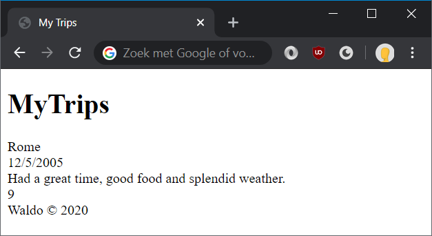

# Lab: Getting started



**The editor**

Our favorite editor for performing web development work is Visual Studio Code. It's a fast, feature-rich, free and open-source text editor. But feel free to choose something you're more comfortable with: WebStorm, Sublime, Atom, Visual Studio, whichever you might prefer.

In Visual Studio Code, use **File > Open Folder** to make a certain a directory your "project directory", which will make VS Code recognize certain configuration files (tslint, editorconfig, etc) as well as use all the files in that directory for giving autocompletion tips.

**Viewing your work**

Use any of the modern webbrowsers (Chrome, Firefox, Brave, Safari or Edge). Please **avoid** using Internet Explorer: it's slow, insecure and doesn't support modern web standards.

To view your progress, simply open Windows Explorer, navigate to an HTML file and double-click on it to view it in a browser. In the browser, you can hit the refresh button (F5) to view any changes you've made to the file.

## Exercise 1: basic structure

In this exercise you will create a web page that will allow the user to see a list of his vacation spots around the world. This page will be extended with more features in later exercises.

1. On your hard drive, create a new folder `trips`. Inside that new folder, create a new file named `index.html`.
1. Open `index.html` in your favorite browser by double-clicking the file. Also open the `trips` folder in your favorite editor.
1. In `index.html`, add a basic HTML structure: `<html>`, `<head>` and `<body>`.

	```html
	<!DOCTYPE html>
	<html>
	<head>
		<!-- page metadata goes here -->
	</head>
	<body>
		<!-- page content goes here -->
	</body>
	</html>
	```
1. Within `<head>`, add a `title` element to set the text in the browser tab.
	```html
	<head>
		<title>My Trips</title>
	</head>
	```
1. Within `<body>`, add a few content elements:

   * a heading element showing `MyTrips`.
		```html
		<h1>MyTrips</h1>
		```
   * a surrounding `div` that holds a few nested `div`'s that in turn hold the details of the trip.
		```html
		<div>
			<div>Rome</div>
			<div>12/5/2005</div>
			...
		</div>
		```
   * a `footer` element for the copyright information. Also, put the year into a `span`. This will be used later on to update the text to the current year.
		```html
		<footer>Waldo &copy; <span>year</span></footer>
		```
    
Your HTML is now done! Your page should now look like this:


