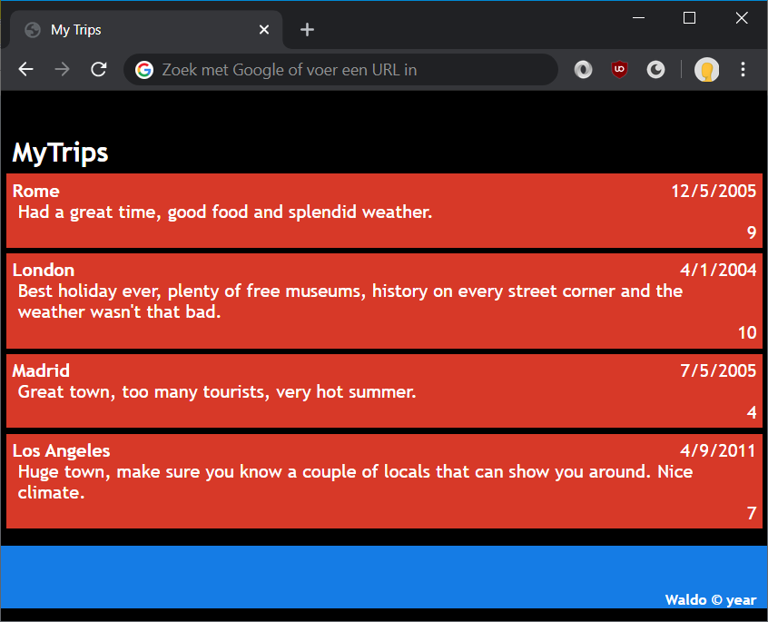
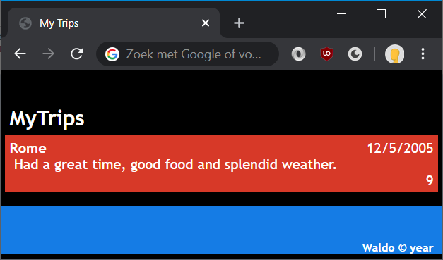

# Lab: Adding style

In this exercise you will use CSS to style the web page of the previous lab.



This lab assumes a so-called dark layout as shown above. Should this not be to your liking, you can always use a site such as [Adobe Kuler](https://color.adobe.com) to find or create a simple set of matching colors.

Also, during this lab you can check your stylesheet for common errors and mistakes at http://htmlhelp.com/tools/csscheck/.

## Exercise 1: using CSS

1. Add a new folder `css` to your project directory with a new file called `default.css`.

1. Add a `<link>` element to the `<head>` of the `index.html` page that refers to the style sheet.
    ```html
    <head>
      <title>My Trips</title>
      <link rel="stylesheet" href="css/default.css">
    </head>
    ```
1. In `default.css` add a style for the `<body>` element, set the margin of the body to 0 and change the font. Let's also the background color and text color.

    ```css
    body {
      margin: 0;
	  font-family: 'Trebuchet MS', sans-serif;
	  background: black;
	  color: silver;
    }
    ```
1. To style the trips, we'll add a few classes and id's to the `<div>` elements. These make it easy to grab a hold of them from CSS.

    ```html
    <body>
	  <h1>MyTrips</h1>
	  
      <div class="trip">
        <div class="city">Rome</div>
        <div class="date">12/5/2005</div>
        <div class="review">Had a great time, good food and splendid weather.</div>
        <div class="rating">9</div>
      </div>
	  
      <footer>Waldo &copy; <span>2020</span></footer>
    </body>
    ```

1. In `default.css`, add some styling. 
	* for the "MyTrips" heading:
		```css
		h1 {
			font-weight: bold;
			font-size: x-large;
			text-align: left;
			padding: 40px 10px 0;
			margin: 0 0 5px 0;
			color: white;
		}
		```
	
	* for the footer:

		```css
		footer {
			background-color: #2676EA;
			color: white;
			font-weight: bold;
			font-size: small;
			text-align: right;
			padding: 40px 10px 0 0;
			margin: 5px 0 0 0;
		}
		```
	* then, the trip itself:
		```css
		.trip {
			background: #D34927;
			color: white;
			padding: 5px;
			margin: 5px;
		}
		```
	* and the information inside the div:
		```css
		.city {
			font-weight: bold;
			margin: 0 5px 0 0;
		}

		.date {
			float: right;
		}

		.review {
			padding: 0 5px 0 5px;
		}

		.rating {
			text-align: right;
		}
		```
1. Because of how `float`ing elements are rendered, we're switching the order of two HTML elements: city and date. The date should be rendered first to `float` on the right side and then the city can fill up the rest of the space.

	```html
	<div class="trip">
		<div class="date">12/5/2005</div>
		<div class="city">Rome</div>
		...
	</div>
	```

Your page should now have a beautifully styled trip.



## Exercise 2: more trips

In this exercise, we'll be adding a few more trips to the page.

1. Since it will now be a list of trips, let's change the trip `div` to a listitem (`li`) inside of a `ul` with the id `trips`.
	```html
	<ul id="trips">
		<li class="trip">
			<div class="date">12/5/2005</div>
			<div class="city">Rome</div>
			...
		</li>
	</ul>
	```
1. By default, a list has a `padding`, a `margin` and some sort of bullet point in front of it. Let's modify this.
	```css
	#trips {
		list-style-type: none;
		margin: 0;
		padding: 10px;
	}
	```
1. Add a few more trips by copying the `li` with the class `trip` and changing the values of city, date, etc.
	```html
	<ul id="trips">
		<li class="trip">
			...
		</li>
		<li class="trip">
			...
		</li>
		<li class="trip">
			...
		</li>
	</ul>
	```

Your page should now have multiple stylish trips beneath each other.


