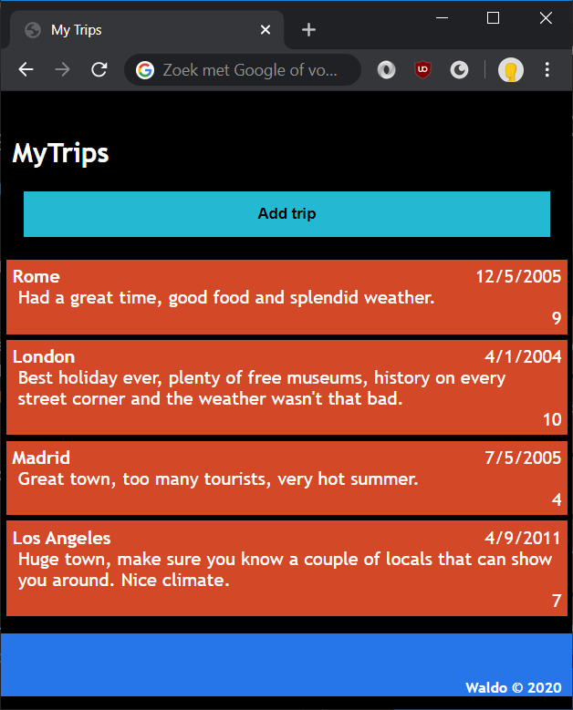

# Lab: JavaScript



## Exercise 1: setting the current year

In this exercise, we will replace the word "year" in the footer by the actual current year.

1. Add a folder called `scripts` to the root of your project. In this new folder, add a text file named `trips.js`.
1. Add a `script` tag to the HTML page inside the `head` tag. Also add a `defer` attribute so our code will be executed once the HTML has been rendered.

    ```html
	<head>
		...
		<script src="scripts/trips.js" defer></script>
	</head>
    ```
1. In `trips.js`, write a function that retrieves the current date and writes the current year to the `<span>` element with id 'copyrightyear'.

    ```js
	let yearSpan = document.querySelector('#copyright-year');
	let currentDate = new Date();
	yearSpan.innerText = currentDate.getFullYear();
    ```

    When you create a new instance of a `Date` object, it will contain the current date.

## Exercise 2: adding trips dynamically

In this exercise, we'll add a trip through JavaScript using the DOM API. There are a couple of ways to go about this:
* **Create all the elements manually** using `document.createElement()` and tieing them together using `.appendChild()`.
* **Appending `innerHTML` with a big string**. From a performance and readability standpoint, this is by far the worst option.
* **Cloning a template** and setting values in that template.

The description below describes the *template method*. Though, feel free to try out the other ones, if you know how or are simply up for a challenge.

To use the template method:

1. In `index.html`, add the template for a trip.

	```html
	<template>
		<li class="trip">
			<div class="city"></div>
			<div class="date"></div>
			<div class="review"></div>
			<div class="rating"></div>
		</li>
	</template>
	```

1. Add a button to the page for adding a trip. When the user `click`s it, call a function `addTrip()`.

	```html
	<button onclick="addTrip();" id="btn-add-trip">Add trip</button>
	```
   Place it to the right of the header using `float` and give it a bit of color.

1. Add a function `addTrip()`.
	```js
	function addTrip() {

	}
	```
1. Implement it by:

	* Selecting the template and copying its contents.
		```js
		let template = document.querySelector('#trip-template').content;
		let clone = document.importNode(template, true);
		```
	* Setting the text values.
		```js
		clone.querySelector('.city').innerText = 'Amsterdam';
		clone.querySelector('.date').innerText = '4/8/2014';
		clone.querySelector('.review').innerText = 'Amsterdam culture is great. A true taste of what Holland is like.';
		clone.querySelector('.rating').innerText = '8';
		```
	* Adding it to the list of trips.
		```js
		document.querySelector('#trips').appendChild(clone);
		```

If all went well, our page should now be able to dynamically add trips!