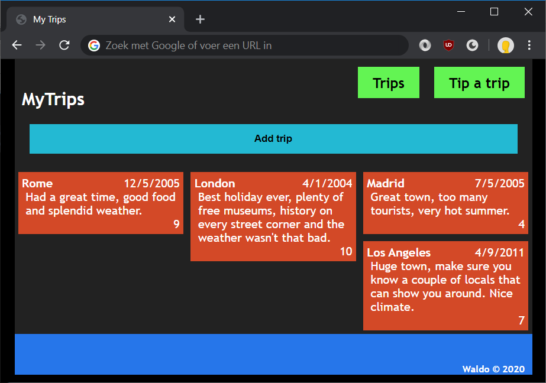
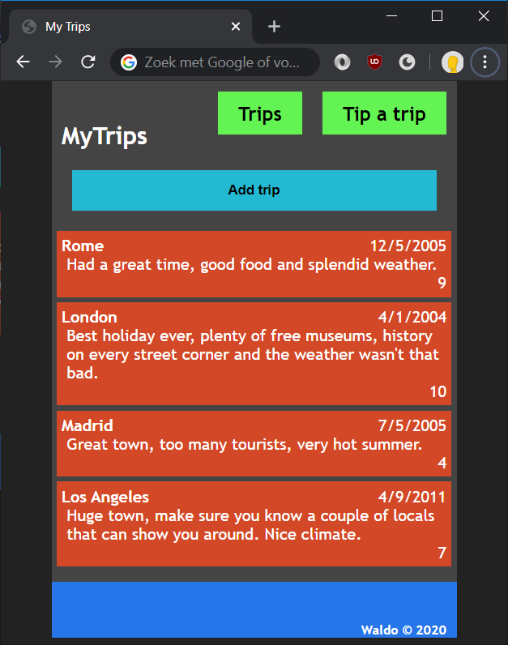
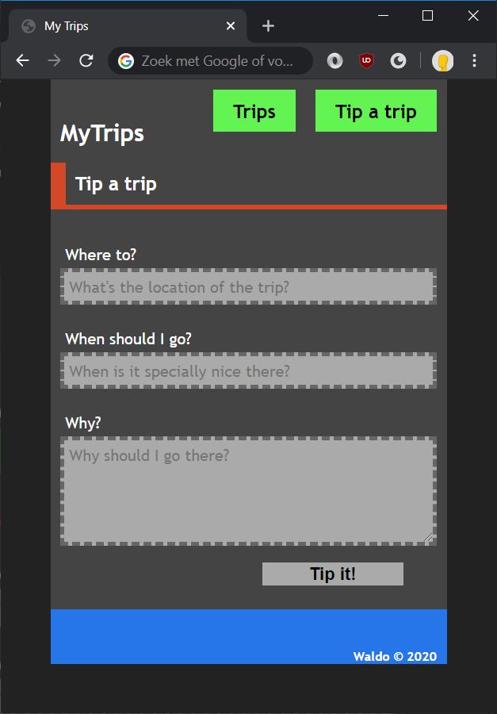

# Lab: Building layouts

## Exercise 1: a full layout



In this exercise, you will transform the trips page as if it was part of a true web application. You will:

* Place all the elements of the web page in a centered container with a fixed width
* Add a navigation bar containing menu items
* Display the trips a bit more fashionable

Let's get started.

1. Turn the existing layout into a fixed layout by adding a container `<div>` directly below the `<body>`, wrapping all elements inside `<body>`.
	```html
		<div id="container">
			<h1>MyTrips</h1>

			...
		</div>
	```

1. In the CSS, add styling for this container to set the `width` to 700 pixels, center it in the middle of the page and give it a simple background color.
	```css
	#container {
		width: 700px;
		margin-left: auto;
		margin-right: auto;
		background-color: #222;
	}
	```
	That's all that's needed to make the layout appear in the middle of the page.

1. Add a simple navigation bar, just like real web applications often have. We will add the navigation bar above the header because it has to be rendered first by the browser.
	```html
	<nav>
		<ol>
			<li><a href="index.html">Trips</a></li>
			<li><a href="tipatrip.html">Tip a trip</a></li>
		</ol>
	</nav>

	<h1>MyTrips</h1>
	```

1. Let's first make sure the navigation renders in the top-right corner of our container.
	```css
	nav {
		float: right;
		margin: 10px 10px 0 0;
	}
	```

1. By default, an ordered list is styled by placing the list items below each other with a digit in front. Using CSS, we will remove the digit and place the items next to each other.
	```css
	nav ol {
		list-style-type: none;
		margin: 0;
		padding: 0;
	}
	nav li {
		float: left;
		margin: 10px 0 10px 20px;
	}
	```

1. And lastly, let's make the hyperlinks themselves look a bit better.
	```css
	nav a {
		padding: 10px 20px;
		background-color: #63F453;
		color: #000;
		text-decoration: none;
		font-size: 1.2em;
		font-weight: bold;
	}
	nav a:hover {
		background-color: #1CB70B;
	}
	```
	The navigation bar should look quite nicely now. If all went well, the menu items should change color when you hover over them.

1. The trips could be displayed better. They take up too much space right now. Let's style them so that three trips are displayed next to each other. Append the existing `.trip` class.
	```css
	.trip {
		/* ... */
		float: left;
		max-width: calc(33.333% - 20px);
	}
	```
   This will throw the footer off a bit. Add a `clear` property to correct this behavior.
	```css
	footer {
		/* ... */
		clear: left;
	}
	```

Congratulations! Our page is beginning to look more like a real website already.

## Exercise 2: adding responsiveness



In this exercise, you will make your web application use responsive design by adding a mobile layout using CSS media queries. To try out these modifications, either
* use built-in browser options, like using the device toolbar from Chrome DevTools.
* resize your browser window to mimic your screen width becoming smaller like a mobile phone.

As for the mobile layout, we will be working with three stylesheets.
* one for mobile users, `mobile.css`
* one for desktop users, `default.css`
* one to hold all the common styles, `common.css`

Let's get started.

1. In `index.html`, add a `viewport meta` tag to regulate the zooming on mobile devices.
	```html
	<meta name="viewport" content="width=device-width, initial-scale=1">
	```
1. In the `css` folder, copy `default.css` and rename the copied file to `common.css`.
1. Create a new file `mobile.css` in the `css` folder.
1. Reference the different stylesheets on the page with their respective media criteria.
	```html
	<link rel="stylesheet" href="css/common.css">
	<link rel="stylesheet" href="css/default.css" media="(min-width: 701px)">
	<link rel="stylesheet" href="css/mobile.css" media="(max-width: 700px)">
	```
1. Within `mobile.css`, we can now place styling specific for small-screen devices. 
   * a slightly lighter `background-color` for the page, e.g. darkgray (`#222`)
   * the `container` `div` should be smaller and have a slightly lighter `background-color` as well
   * we also want the trips to be shown below each other, but we'll get to that in a bit
1. Within `common.css`, remove styles that aren't common.
   * trips should only float for desktop users and only be constrained in width when floating
   * `container` width differs for mobile/desktop users
   * `background-color` for the page and `container` differs for mobile/desktop users
1. In `default.css`, remove styles that have already been set in the common stylesheet. Use the list from the previous point.

If all went well, you should see a different display of the trips page when you resize your browser window.

## Exercise 3: build a form



In this exercise, you will add a form and style the form to make it look fashionable. This form would normally allow people to submit a tip for a trip. Note that we will not actually make this form work, that requires a server-side implementation, we will just do all the frontend work required for the form to work.

1. Copy `default.html` and rename the copied file to `tip-a-trip.html`. In the new file, remove the `button`, `template` and the `ul` with id `trips` so a relatively "clean" page remains: a header, the navigation and a footer, all inside a container.
1. Add a `form` element just below the navigation.
	```html
	<nav>
		...
	</nav>

	<form action="#" method="post">

	</form>
	```

1. Within the form element, add input fields, accompanied by labels, helper texts and a submit button.
	```html
	<form action="#" method="post">
		<ol>
			<li>
				<label for="input-location">Where to?</label>
				<input id="input-location">
				<span>What&#039;s the location of the trip?</span>
			</li>
			...
		</ol>
	</form>
	```
1. This form could use some styling. Let's start by removing the digits in front of the form fields. In `common.css`, we're already doing the same thing for the navigation list. Append that selector for the form list.
	```css
	nav ol, form ol {
		/* ... */
	}
	```
1. Edit the `common.css` and add a bit of styling for aligning the labels with the input fields and giving them a slightly more noticeable color.
	```css
	form label {
		display: block;
		color: white;
	}
	```
1. Let's make all the input fields the same length. Let's also give them a nice `border` and `background-color`. Let's also do something about the `font`, the `textarea` uses the notepad font by default.
	```css
	input, textarea {
		border: 4px dashed #666;
		background-color: #aaa;
		padding: 5px;
		font-family: 'Trebuchet MS', sans-serif;
		font-size: 1.0em;
		outline: none;
	}
	```
1. At this point, the `button` is styled the same way as the `input` fields.  Give a different `border`, make the text bold and align the button with the rest of the controls.
	```css
	form button {
		border: 4px solid #444;
		background-color: #aaa;
		font-weight: bold;
		font-size: 1.1em;
		margin-left: 200px;
		width: 150px;
	}
	```
1. Now create some room between the different controls by giving some padding to the `li`s containing the labels and input fields.
	```css
	form li {
		padding: 5px 10px;
	}
	```
1. Those are all the common styling changes. Now switch to `default.css` and add some styling to make the labels `float` next to the `input` fields.
	```css
	form label {
		float: left;
		clear: left;
		text-align: right;
		width: 140px;
		padding: 12px;
	}
	```
   Also give our `input`s and `textarea` a width to make them more look alike.
	```css
	input, textarea {
		width: 300px;
	}
	```
1. As for our mobile view, open up `mobile.css`. Our labels should be above the `input` fields and the `input` fields itself should take up the full width available.
	```css
	form label {
		padding: 15px 0 5px 5px;
	}
	input, textarea {
		width: calc(100% - 8px - 10px);
	}
	```

There! Our form is looking great for both desktop and mobile users.

Feel free to add an extra header to let the end-user know this is the tip-a-trip page.
