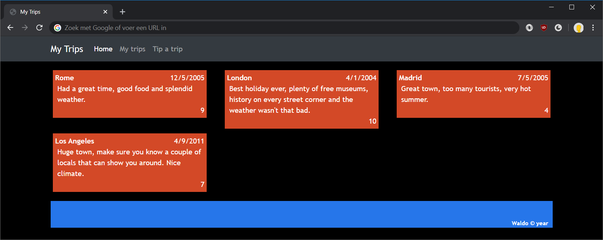
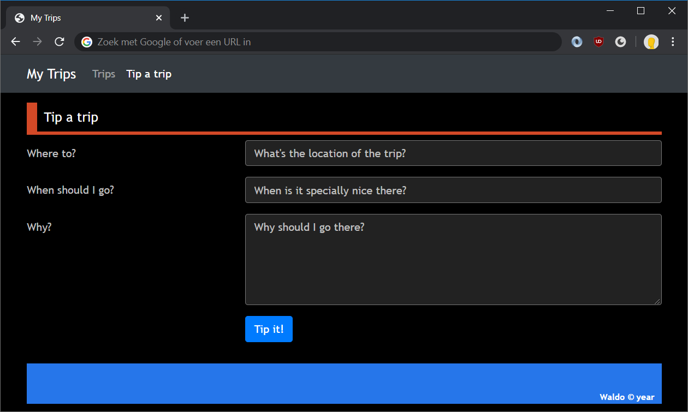

# Lab: CSS frameworks

Before we begin, create a **backup of the previous lab**. This lab will build a layout from the ground up, it does not build upon the previous exercise. A **future lab** will though, that's what the backup is for.

This exercise will only use the stylesheets of the previous lab.

**Bootstrap?**

The step-by-step description below assumes Bootstrap as CSS framework. But feel free to choose another CSS framework to complete this lab with.

## Exercise 1: grid and navigation

In this exercise, you will build a layout using the grid system of Bootstrap as well as its "navbar".



1. Create a completely new folder for this exercise. Open it in Visual Studio Code using **File > Open Folder**.
1. Create an `index.html` and fill it with a basic HTML template.
1. Create a folder called `css`. Copy all the stylesheets from the previous exercise to this subfolder.
1. Download [Bootstrap](https://getbootstrap.com/). Also download [jQuery](https://jquery.com/) since Bootstrap's interactive components depend on it. Place both (unzipped) in a new folder `libs`.
1. In `index.html`, define the base structure of the webpage. Reference our own custom stylesheets. Also and reference the libraries.
	```html
	<link rel="stylesheet" href="libs/bootstrap-4.4.1-dist/css/bootstrap.css">
	<link rel="stylesheet" href="css/common.css">
	<link rel="stylesheet" href="css/default.css" media="(min-width: 701px)">
	<link rel="stylesheet" href="css/mobile.css" media="(max-width: 700px)">
	<script src="libs/jquery-3.4.1.js"></script>
	<script src="libs/bootstrap-4.4.1-dist/js/bootstrap.js"></script>
	```
1. In our own CSS, we need to remove a couple of positioning styles as they conflict with Bootstrap.
   * `common.css`: `#container`, `nav ol, form ol`, all selectors starting with `nav` and `#trips`. In the `footer` styling, remove only the `clear` property
   * `default.css`: `#container`, `nav` and `.trip`
   * `mobile.css`: `#container`
1. Now we can start using Bootstrap. Let's begin by adding a header with navigation. Go to the [Bootstrap documentation on the navbar](https://getbootstrap.com/docs/4.0/components/navbar/) and try out a couple of the examples there. Then pick a couple of classes to make the navbar work the way you want it:
   * with a dark background, `navbar-dark` and `bg-dark`
   * fixed at the top of the page, `fixed-top`
   * with responsiveness built in, `navbar-expand-lg`
	```html
	<body>
		<nav class="navbar fixed-top navbar-expand-lg navbar-dark bg-dark">
			...
		</nav>
	</body>
	```
   Then tweak the links to be relevant for our website.
1. In `common.css`, add a bit of margin so our navigation bar doesn't overlap with content.
	```css
	body {
		...
		margin-top: 70px;
	}
	```
1. Next up are our trips. Start by declaring a container that centers our layout and restricts its width. Also add a `row` that holds the trips.
	```html
	<body>
		<div class="container">
			<div class="row">

			</div>
		</div>
	</body>
	```
1. Within the `row`, add a `div` for every trip. A trip should be 4 columns wide on large screens and take up all space on smaller screens.
	```html
	<div class="col-xs-12 col-sm-12 col-lg-4">
	```
1. Add a trip `div` within the column `div`:
	```html
	<div class="col-xs-12 col-sm-12 col-lg-4">
		<div class="trip">
			<div class="date">12/5/2005</div>
			<div class="city">Rome</div>
			...
		</div>
	</div>
	```
	After adding the first trip, add the other two trips.
1. And finally, add the footer. This should always span the entire width, so we can create a `row` with one `col` inside of it that contains the header.
	```html
	<div class="row">
		<div class="col">
			<footer>
				Waldo &copy; <span id="copyright-year">year</span>
			</footer>
		</div>
	</div>
	```

That's it! We've now successfully built the layout using Bootstrap's grid system.

## Exercise 2: a Bootstrap form

In this exercise, we'll be rebuilding the "tip a trip" page using Bootstrap's supports for forms. Note that Bootstrap doesn't offer dark styling for form fields, so it will contrast a bit with our dark page.



1. To start, let's remove all our own form styling from our CSS files
1. Go to [Bootstrap's form documentation](https://getbootstrap.com/docs/4.0/components/forms/#form-grid) on "Horizontal forms". Use the example there 
   * Remove the groups for demonstrating radiobuttons and checkboxes
   * Copy one row so we can add the textarea
   * Changes the input `id`s & placeholders, label texts & `for`s
   * Tweak the columns over which the label and input fields are spanned
   * For non-mobile screens, add a bit of offset to the submit button
1. Because Bootstrap doesn't offer styling for dark layouts, we'll do it ourselves. In `common.css`, add a bit of custom styling to override Bootstrap's colors.
	```css
	.form-control {
		background: #222;
		border: 1px solid #777;
		outline: none;
	}
	.form-control:active, .form-control:focus {
		background: #555;
		box-shadow: 0 0 10px 0px white;
		border: 1px solid silver;
	}
	.form-control::placeholder {
		color: silver;
	}
	```

If all went well, you should now have a beautiful, mobile-ready form, built with Bootstrap's form features!